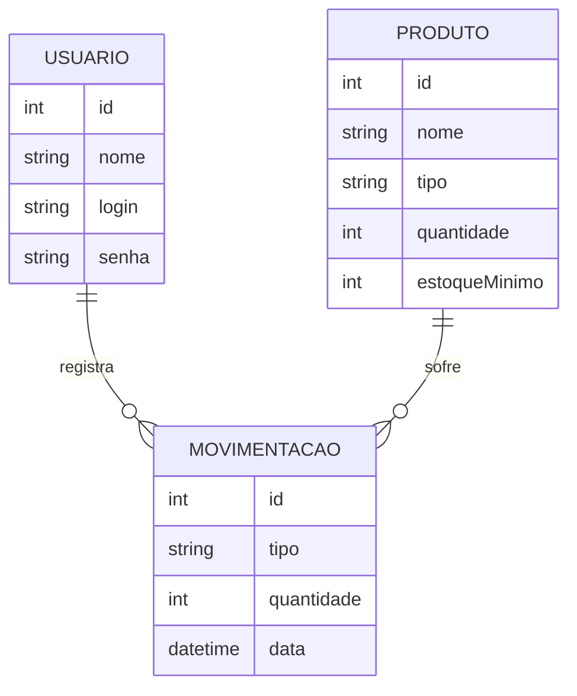

# Diagrama Entidade-Relacionamento (DER)

Usuario (id, nome, login, senha)
Produto (id, nome, tipo, quantidade, estoqueMinimo)
Movimentacao (id, produtoId FK, usuarioId FK, tipo, quantidade, data)

Relacionamentos:
- Usuario 1:N Movimentacao (um usuário faz várias movimentações)
- Produto 1:N Movimentacao (um produto tem várias movimentações)

